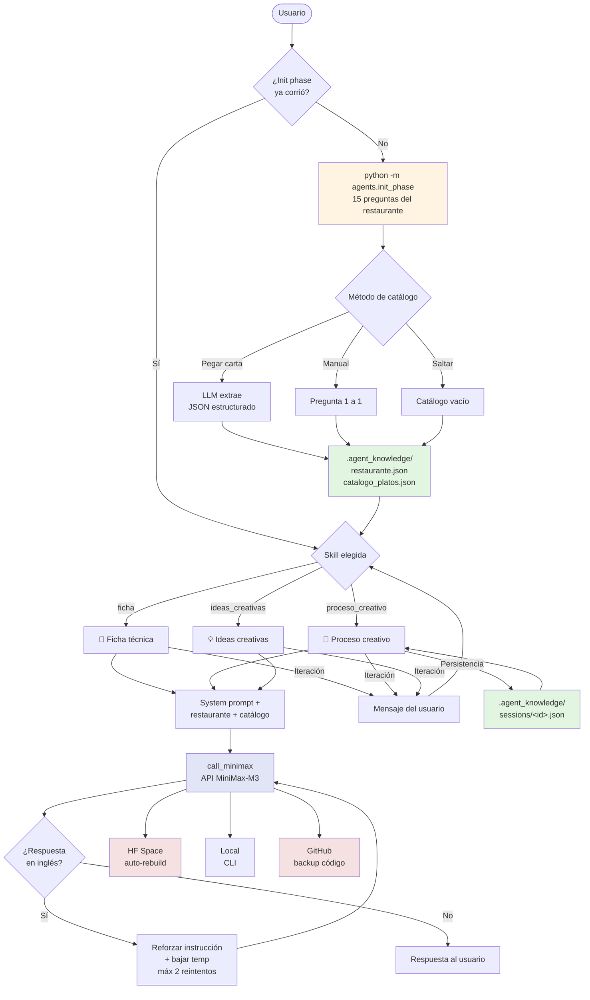

# 📊 Diagrama de flujo — Chef Creativo

Diagrama del flujo completo del sistema. Renderizá en https://mermaid.live/ o cualquier visor Mermaid.

```mermaid
flowchart TB
    Start([Usuario]) --> Init{¿Init phase<br/>ya corrió?}

    Init -->|No| InitPhase[python -m agents.init_phase<br/>15 preguntas del restaurante]
    InitPhase --> InitCarta{Método de catálogo}
    InitCarta -->|Pegar carta| LLMCarta[LLM extrae<br/>JSON estructurado]
    InitCarta -->|Manual| ManualCat[Pregunta 1 a 1]
    InitCarta -->|Saltar| SinCat[Catálogo vacío]
    LLMCarta --> Knowledge[.agent_knowledge/<br/>restaurante.json<br/>catalogo_platos.json]
    ManualCat --> Knowledge
    SinCat --> Knowledge

    Init -->|Sí| Skill{Skill elegida}

    Knowledge --> Skill

    Skill -->|ficha| FichaSkill[🍂 Ficha técnica]
    Skill -->|proceso_creativo| PCSkill[🧠 Proceso creativo]
    Skill -->|ideas_creativas| ICSkill[💡 Ideas creativas]

    FichaSkill --> Inyect[System prompt +<br/>restaurante + catálogo]
    PCSkill --> Inyect
    ICSkill --> Inyect

    Inyect --> LLM[call_minimax<br/>API MiniMax-M3]

    LLM --> Detect{¿Respuesta<br/>en inglés?}
    Detect -->|Sí| Retry[Reforzar instrucción<br/>+ bajar temp<br/>máx 2 reintentos]
    Retry --> LLM
    Detect -->|No| Response[Respuesta al usuario]

    FichaSkill -->|Iteración| UserMsg[Mensaje del usuario]
    PCSkill -->|Iteración| UserMsg
    ICSkill -->|Iteración| UserMsg
    UserMsg --> Skill

    PCSkill -->|Persistencia| Sessions[.agent_knowledge/<br/>sessions/&lt;id&gt;.json]
    Sessions --> PCSkill

    LLM --> HF[HF Space<br/>auto-rebuild]
    LLM --> Local[Local<br/>CLI]
    LLM --> GH[GitHub<br/>backup código]

    style InitPhase fill:#fff4e1
    style Knowledge fill:#e1f5e1
    style LLM fill:#e1e5f5
    style Sessions fill:#e1f5e1
    style HF fill:#f5e1e1
    style GH fill:#f5e1e1
```
